The oral exam is without preparation. That means that you come in and then we (examiner and external examiner) ask questions. The exam is approximately 20 minutes.  We will ask you questions about different subjects in the curriculum. The questions can fx be of the following form (but are not limited to):

* Which algorithms/data structures do you know that solves the following problem?
* How does algorithm/data structure X work?  
* Run algorithm/data structure X on the following example,
* Analyse the running time or space of algorithm/data structure X,
* Argue correctness of algorithm/data structure X.

# 1. Hashing:

Want a random, crazy, chaotic function that maps a large universe to a small range. The
function should distribute the items “evenly.”

• Low collision probability: for any x≠y, we want Pr(h(x) = h(y)) to be small.
• Fast evaluation.
• Small space.

## 1.1 Dictionary problem

A dynamic set of integers $S \subseteq U$ to support `lookup`, `insert` and `delete`.

We want a compact data structure with fast operations.

### Chained Hashing

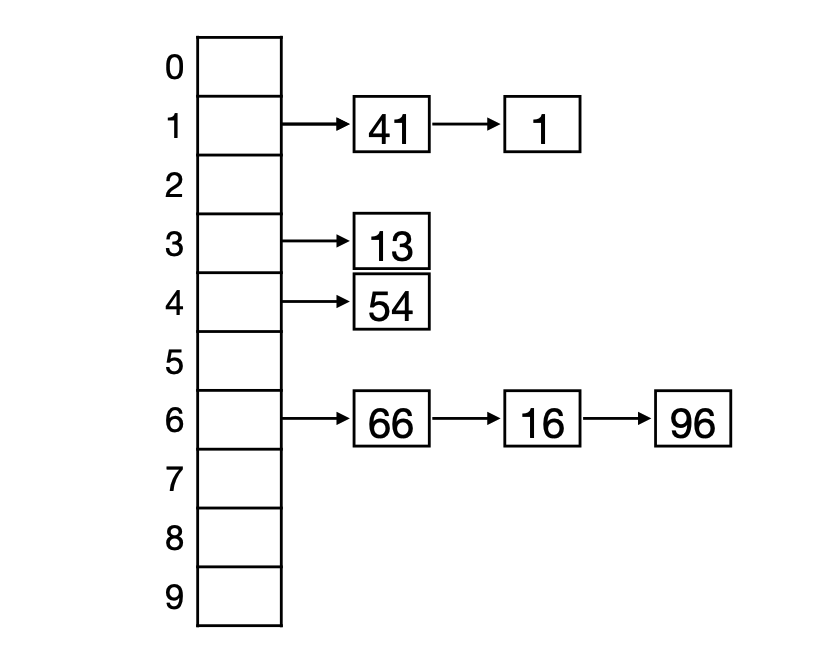

> Choose universal hash function $h$ from $U$ to ${0, ..,m-1}$.
> 
> Initialize an array $A[0, ..., m-1]$.
> 
> $A[i]$ stores a linked list containing the keys in $S$ whose hash value is $i$.
>
> Space: $O(m + n) = O(n)$
> 
> Time: $O(1 + |A[h(x)]|)$
>

## 1.2 Static dictionary problem

A set $S \subseteq U$ of size $n$ to support LOOKUP(x).

We want a collision-free hash function on S with $O(n)$ space and $O(1)$ worst-case lookup time.

### JKS-Scheme

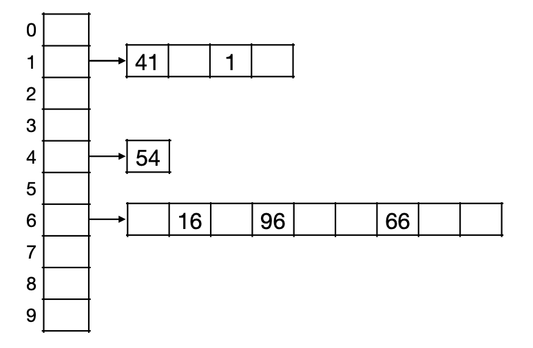

> Two-level solution:
> * At level 1 use solution with many collisions and linear space.
> * Resolve each collisions at level 1 with collision-free solution at level 2.
>
> Spce: $O(n)$ and $O(n)$ expected preprocessing time.
> 
> Time: $O(1)$ worst-case time per lookup.
>

## 1.3 String matching

Given strings S and P, determine if P is a substring in S. 

|P| = m, |S| = n.

### Karp-Rabin Fingerprint

> Let S be a string of length n. 
>
> Let p is a prime number. Pick uniformly at random integer z ∈{0, ..., p-1}.
>
> The fingerprint of $S$ is the polynomial over the field $Z_p$ evaluated at the random integer $z$.
> 
>$$\varphi_{p,z}(S) = \left( \sum_{i=1}^{n} S[i] \cdot z^{n - i} \right) \mod p$$
> 

### Karp-Rabin Algorithm

> Pick $p >= m^2$
> 
> Compute $\varphi(P)$
>
> Compute and compare $\varphi(S[i, i+m-1])$ with $\varphi(P)$ for all i.
>
> If fingerprints match, verify using brute-force comparison. 
>
> Time: $O(m + n + Fm)$
>

# 2. Predecessor:

Maintain a set S ⊆ U = {0, ..., u-1} to support `predecessor`, `successor`, `insert` and `delete`.

We want a Static predecessor with $O(log log u)$ query time.

## van Emde Boas

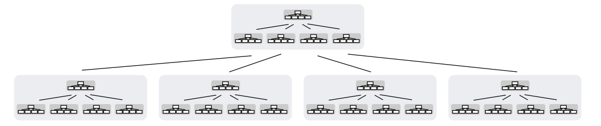

> Apply `Two-Level Bitvector` until size of vectors is constant.
>
> > Space: $O(u)$
> >
> > Time: $𝖳(𝗎) = 𝖳 (𝗎)+ 𝖮(𝟣) = 𝖮(log log 𝗎)$
>

## Y-Trie

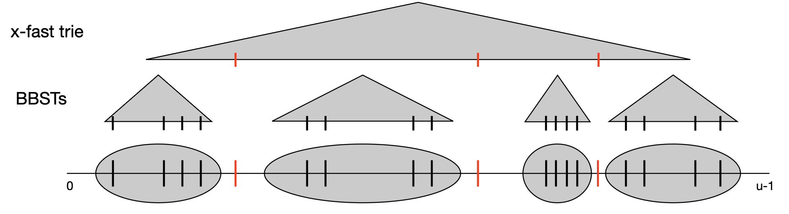

> Partition $S$ into $\frac{n}{log u}$ groups of $log u$ consecutive keys
>
> Compute $S'$ = set of split keys between groups.
>
> X-fast trie over S’:
> 
> * A binary tree with min and max for each node + keys ordered in a linked list.
>
> * For each level store a dictionary of prefixes of keys. 
>
> Balanced binary search trees for each group.
>
> > Space: X-fast trie: $O(\frac{n}{log u} log u) = O(n)$, all BBSTs: $O(n)$
> >
> > Time: X-fast trie: $O(log log u)$, BBST: $O(log (log u))$

# 3. RMQ and LCA

## 3.1 Range Minimum Queries
Preprocess array $A[1…n]$ of integers to support $RMQ(i,j)$ to return the minimum element in $A[i…j]$.

### Sparse table

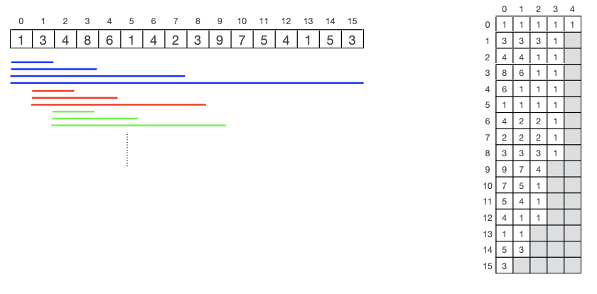

> Save the result for all intervals of length a power of 2.
>
> Query: any interval is the union of two power of 2 intervals. Lookup results for the two intervals and take minimum.
>
> > Space: $O(n log n)$
> >
> > Time: $O(1)$
> >
> > Preprocesing time: $O(n log n)$. To compute results for length $2^i$ use results for length $2^{i-1}$.

## 3.2 ±1RMQ

Consecutive entries differ by 1.

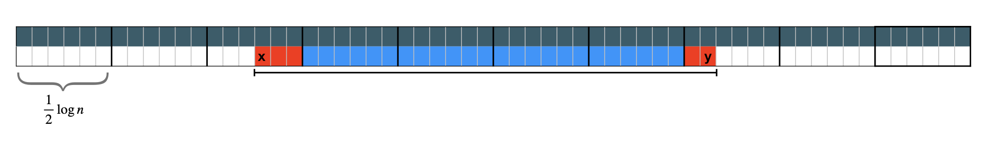

> Divide $A$ into blocks of size $\frac{1}{2} logn$.
>
> > On blocks:
> >
> > 
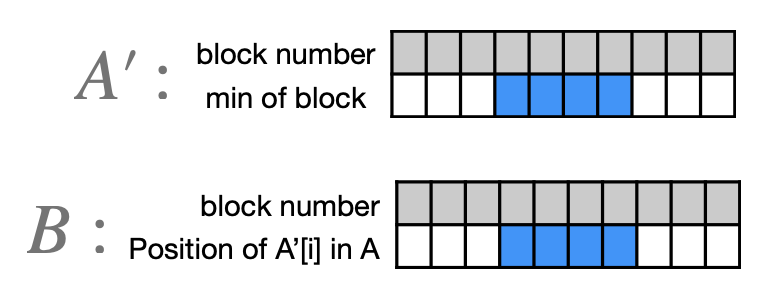

> >
> > > $A'$: minimum from each block
> > >
> > > $B$: position in $A$ where occurs.
> > >
> > > Sparse table data structure on $A'$.
> > >
> > Space: $O(|A'| log |A'|) = O(\frac{n}{logn} log \frac{n}{logn})$ = $O(n)$
> 
>
> > Inside blocks:
> > 
> > 

> >
> > > Precompute and save all answers for each normalized block.
> > >
> > > > Block is sequence of +1s and -1s.
> > > > 
> > > > Number of block descriptions: $2^{\frac{1}{2} logn - 1} ≤ \sqrt{n}$
> > >
> > Space: $O(O(\sqrt{n}(log^2 n)) + O(\frac{n}{logn}))$ = $O(n)$
>
> Space: SparseTable + PrecomputedTables = $O(n)$
>
> Time: $O((1+1) + 1 + 1)$

## 3.2 Lowest Common Ancestor
Preprocess rooted tree $T$ with $n$ nodes to support querying the lowest common ancestor of $u$ and $v$.

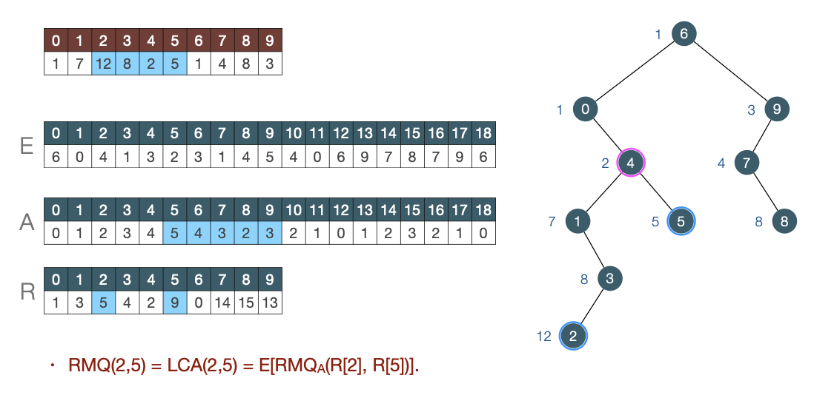

> Build a `Cartesian Tree` on array.
>  > The value in subtree root is minimum. 
>  > 
>  > Inorder of tree (left->root->right) is the original array.
> 
> $E$: Euler tour representation. Preorder walk, write id of node when met.
>
> $A$: Depth of node node in $E[i]$. 最小的值代表路径中的根
>
> $R$: First occurrence in $E$ of node with id $i$. 第一次访问某节点时，是从根走到它的路径上的第一个“入点”，在 DFS 遍历过程中，你要访问 u 和 v，就必须先经过它们的 LCA
>
> $RMQ(i, j) = LCA(i, j) = E[RMQ_A (R[i], R[j])]$
>
> Space: $O(E+A+R+RMQ_A)$

# 4. Level Ancestor

Preprocess rooted tree T to support querying the $kth$ ancestor of node $v$.

## 4.1 Top-Bottom Decomposition

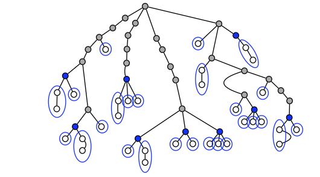

> > Jump nodes: maximal **deep** nodes with ≥ $\frac{1}{4} log n$ descendants.
>
> > Top tree: 
> > > Ladder decomposition + Jump pointers for jump nodes, at most $\frac{n}{\frac{1}{4}logn}$ leaves.
> > >
> > > For each internal node pointer to some jump node below.
> > 
> > > $LA(v,k)$ in top:
> > >
> > > Follow pointer to jump node below $v$.
> > > 
> > > Jump pointer + ladder solution.
> >
> > > Space: O(|ladder| + |jump_nodes|*|tree_height|) = $O(n + \frac{n}{logn} logn) = O(n)$ 
> > >
> > > Time: O(1)
>
> > Bottom tree:
> > 
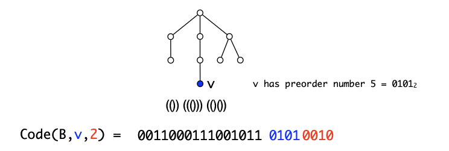

> >
> > > Encode each bottom tree `B` using balanced parentheses representation.
> > > 
> > > Encode inputs v and k.
> > > 
> > > Build table $A[code(B, v, k)] = LA(v, k)$ in bottom tree `B`.
> >
> > > $LA(v,k)$ in bottom: Lookup in $A$.
> >
> > > Space: $O(2^{|code|}) = O(2^{2 \cdot \frac{1}{4} logn + 2 \cdot log(\frac{1}{4} logn)}) < O(n^{\frac{1}{2}}log^2n) < O(n)$
> > >
> > > Time: O(1)

# 5. Suffix Trees

## 5.1 String indexing problem
Preprocess a string $S$ to search the starting positions of all occurrences of $P$ in $S$.

### Suffix Tree

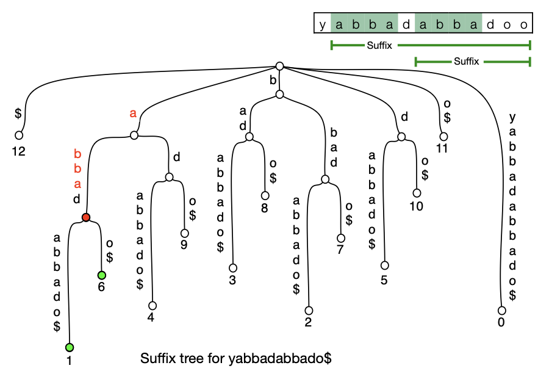

>
> The compact trie of all suffixes of S.
>
> > Space: O(Number of edges + space for edge labels + string) = $O(n)$
> > 
> > Time: $O(|P|+occ)$
> >
> > Preprocessing time: $O(sort(n,|Σ|))$.  Time to sort $n$ characters from an alphabet $Σ$.

## 5.2 Longest common substring problem
Find longest common substring of strings $S_1$ and $S_2$.

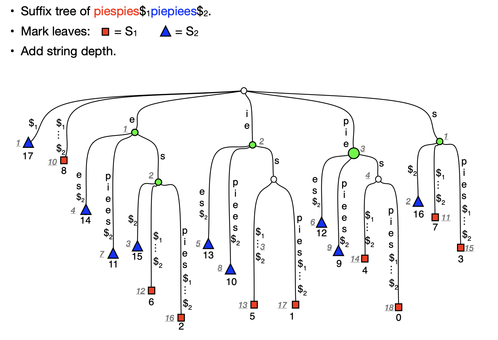

> The suffix tree over $S_1\$1S_2\$2$.

# 6. Radix and Suffix Sorting

## 6.1 Sorting small universes problem

Given a sequence of $n$ integers from a universe $U = \{0, 1, ..., u-1\}$ that is not too big.

### Radix sort

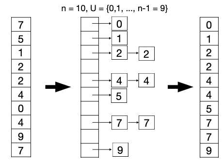

> Sort on each digit from right to left using stable sort.
> 
> For each digit, insert into array of linked list + traverse array of linked list.
>
> > Space: $O(n+u)$
> >
> > Time: $O(n \cdot k)$

## 6.2 Suffix sort problem

Given string $S$ of length $n$ over alphabet $Σ$, sort all suffixes of S in lexicographic order.

### Difference Cover Sampling

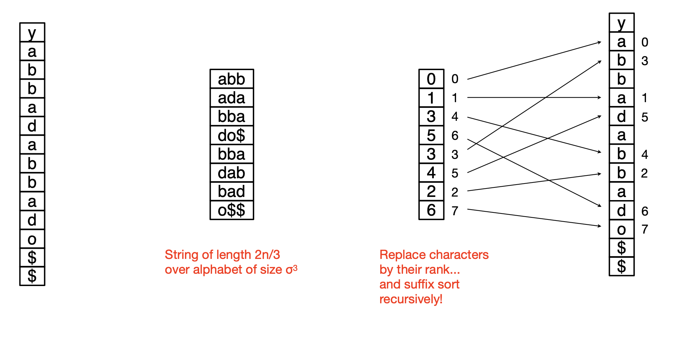

> Recursively sort sample suffixes starting at positions $i = 1 \mod 3$ and $i = 2 \mod 3$.

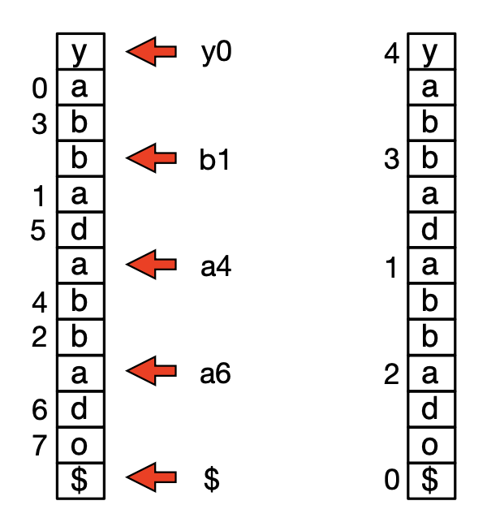

> Sort Non-Sample Suffixes.

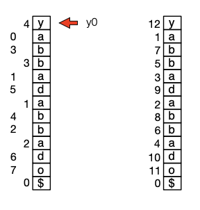

> Merge
>
> * When compare $S_0$ with $S_1$：$(S[i], \text{rank}[i+1]) \stackrel{?}{\leq} (S[j], \text{rank}[j+1])$
>
> * When compare $S_0$ with $S_2$：$(S[i], S[i+1], \text{rank}[i+2]) \stackrel{?}{\leq} (S[j], S[j+1], \text{rank}[j+2])$

> Time: $T(n) = T(2n/3) + O(n) = O(n)$

# Week7 Compression:

## Lempel-Ziv 77

**Encode**

> Build suffix tree. Store smallest leaf below each node.
> 
> 
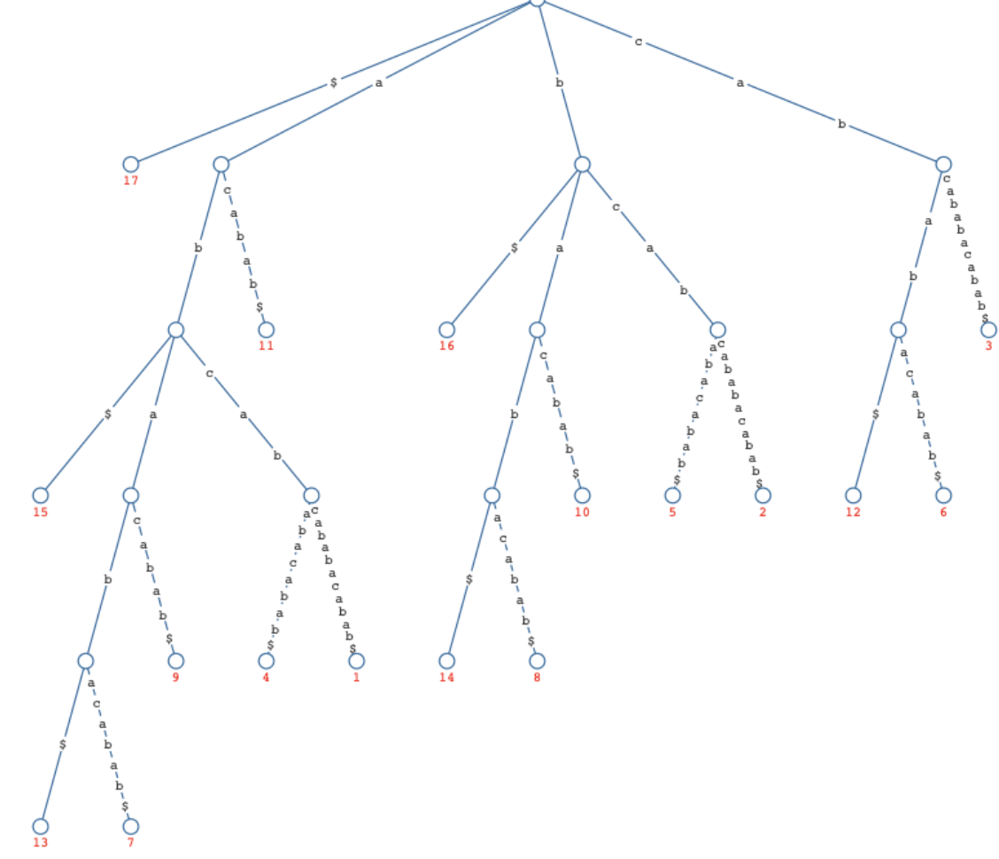

>
> Parse from left-to-right into phrases.
> > 
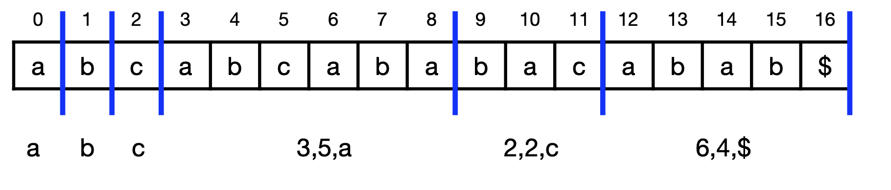

> >
> > Select longest matching substring starting before current position + 1 extra character.
> >
> > Encode phrases by (previous occ dist, length, extra character) or single character.
>
> > Time: $O(sort(n, |Σ|).$

**Decode**

>  Read and decode left-to-right.

## Lempel-Ziv 78

**Encode**

> 
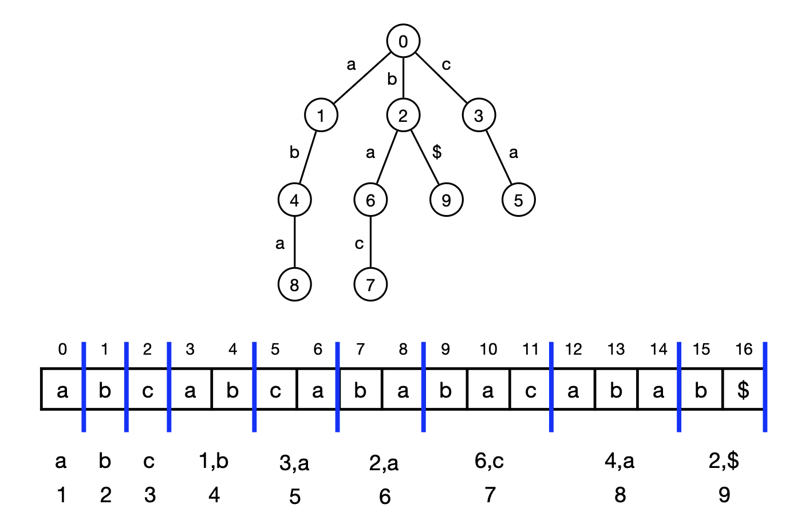

>
> Dynamically build and traverse the LZ78 trie.
>
> Parse from left-to-right into phrases.
> 
> Select longest phrase seen before + a single character.
> 
> Encode phrases (previous phrase, character) or single phrase.
>
> > Time: $O(N)$ expected

**Decode**

> Read and decode left-to-right.
>
> > Time: $O(N)$

## Recursive-pairing compression

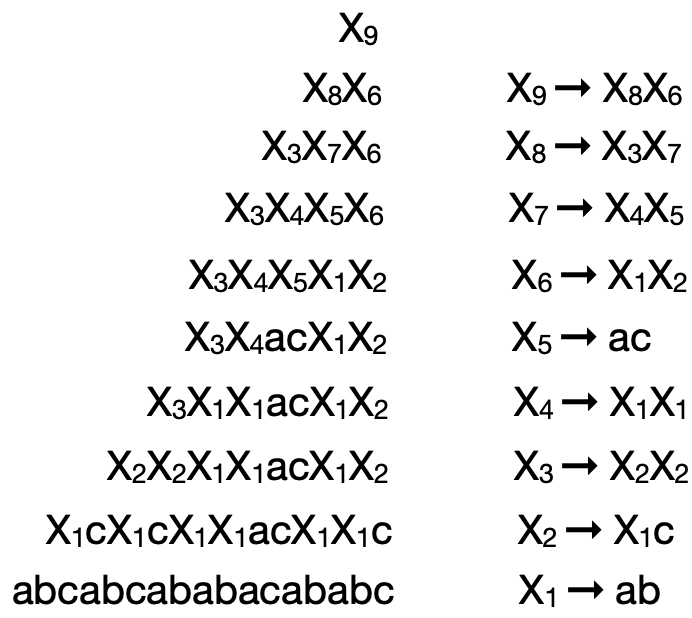

> Start with string $S$.
>
> Replace a most frequent pair by new character $X_i$. Output rule $X_i ➞ ab$.
>
> Repeat until we have a single pair.

>  Unfold rules top-down.

## Grammar Compression

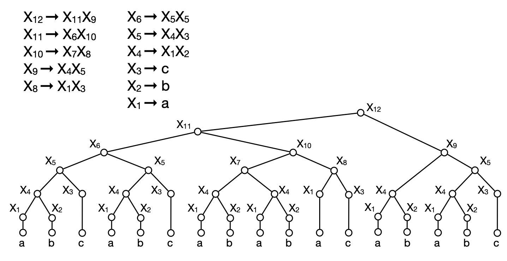

> Encode string $S$ as an grammar $G$ that generates $S$.

> Parse tree. Unfolded set of rules.

# Week8 External Memory 1

## 8.1 Sorting

Given array $A$ of $N$ values, output the values in increasing order.

### External Merge Sort

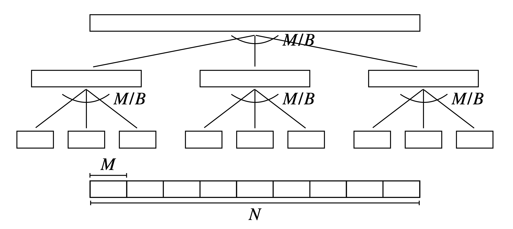

> Partition $N$ elements into $\frac{N}{M}$ arrays of size $M$.
> 
> Load each into memory and sort.

> Apply $\frac{M}{B}$ way external multiway merge until left with single sorted array.
>
> > 
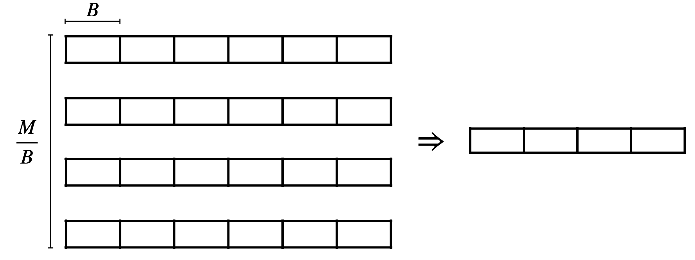

> > 
> > Load $\frac{M}{B}$ first blocks into memory.
> > 
> > Output the smallest number among blocks.
> > 
> > Load more blocks into memory if needed.
> >
> > Repeat

> I/Os: $O(\frac{N}{B} + \frac{N}{B} log_\frac{M}{B} \frac{N}{M})$

## 8.2 Searching

Maintain a set $S ⊆ U = \{0, ..., u-1\}$ to support `search`, `insert` and `delete`.

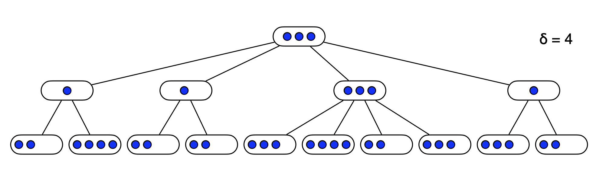

> B-tree of order $δ = ϴ(B)$ with $N$ keys.
> > Keys in leaves.
> > 
> > Degree between $\frac{δ}{2}$ and $δ$.
>
> > Root degree between 2 and δ.
>
> > Height: $log_\delta \frac{N}{B}$

# Week9 External Memory 2

## 9.1 Access Path Traversal problem

Data structure $D$ stores a dynamic set of items. We can only access $D$ by following an access path $P$.

### Buffered updates

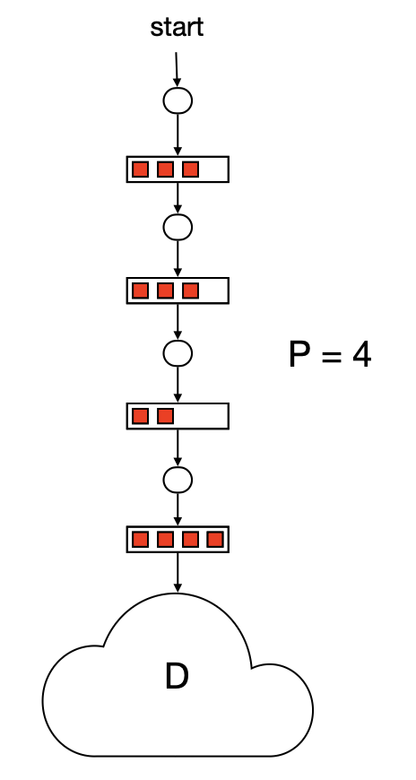

> Add buffers of size $B$ to each edge stored in O(1) blocks.
>
> Buffers store delayed updates to $D$
>
> > Search: $O(P)$
> >
> > Update: $O(\frac{P}{B})$

## 9.2 Searching with Fast Updates

### $B^\epsilon$-tree

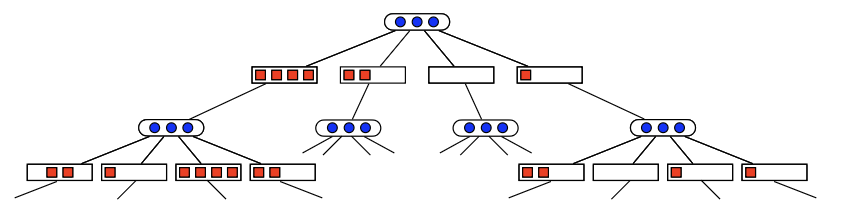

> Speed up updates by buffering them at each node along the path to a leaf.
>
> Move many updates together in each I/O.
>
> Insert delayed insert/delete into first buffer on path. If full, flush and recurse on next node in path. If we fill leaf, rebalance tree as B-tree.
>
> $\epsilon ∈ (0, 1]$ is a parameter.
>
> > 
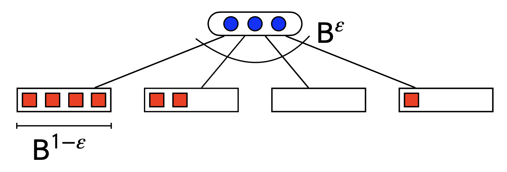

> >
> > Height: $log_{b^\epsilon} N = \frac{log_b N}{\epsilon}$
> >
> > Search: $O(\frac{log_b N}{\epsilon})$
> >
> > Update: $O(\frac{Height}{Buffer}) = O(\frac{log_b N}{\epsilon \cdot B^{1-\epsilon}})$

# Week11 Range Report

Preprocess at set of points $P ⊆ \mathcal{R}^2$ to return the set of points in $R$, where $R$ is rectangle given by $(x_1, y_1)$ and $(x_2, y_2)$.

## 2D Range Tree + Bridges

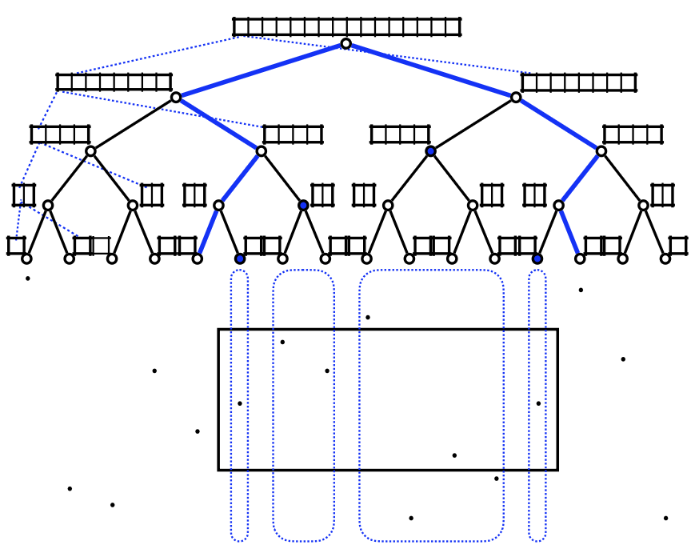

> Perfectly balanced binary tree over $x$-coordinate.
>
> Each node $v$ stores array of points below $v$ sorted by $y$-coordinate.
>
> Each point in array at $v$ stores bridges to arrays in $v_l$ and $v_r$
>
> Arrays at $v_l$ and $v_r$ are subsets of array at $v$. 
>
> $Report(x1, y1, x2, y2)$: 
> > Find paths to predecessor of $x_1$ and successor of $x_2$, get each `off-path` node.
> > 
> > Binary search predecessor of $y_1$ and successor of $y_2$ in root array + traverse bridges for remaining 1D queries.
>
> > Space: $O(n logn)$
> >
> > Time: $O(logn + occ)$
> >
> > Preprocessing. $O(nlog n)$

## kD-tree

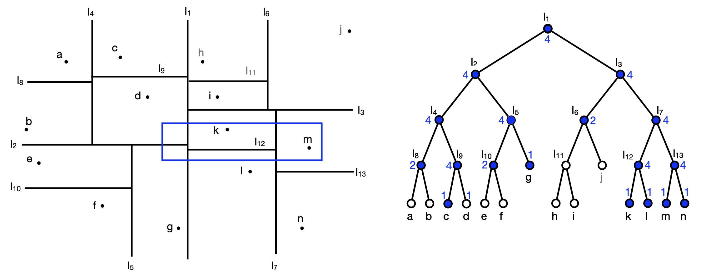

> A balanced binary tree over point set $P$.
>
> Recursively partition $P$ into rectangular regions containing (roughly) same number of points. Partition by alternating horizontal and vertical lines.
>
> Each node in tree stores region and line.
>
> > $Report(x1, y1, x2, y2)$: Traverse 2D tree starting at the root. At node $v$:
> >
> > 1. $v$ is a leaf: report the unique point in region($v$) if contained in range.
> > 2. region($v$) is disjoint from range: stop.
> > 3. region($v$) is contained in range: report all points in region($v$).
> > 4. region($v$) intersects range, and $v$ is not a leaf. Recurse left and right.
>
> > Space: $O(n)$
> >
> > Time: $O(\sqrt{n} + occ)$
> >
> > Preprocessing. $O(nlog n)$

# Week10 Approximation 1

## 10.1 Load balancing

Schedule $n$ jobs on $m$ machines so as to minimize the maximum load $T$.

### Longest processing time rule

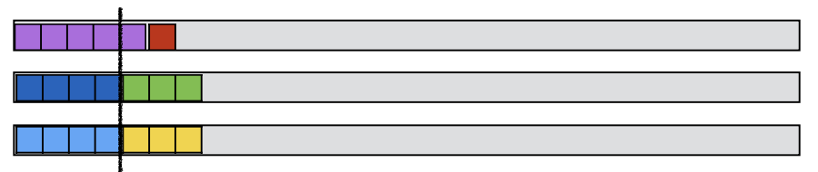

> Sort jobs in non-increasing order. Assign next job on list to machine as soon as it becomes idle.
>
> > $t1 ≥ …. ≥ t_n$
> > 
> > $t_m ≥ t_{m+1}$
> >
> > $T^* ≥ t_m + t_{m+1}$  =>  $T^* ≥ 2t_{m+1}$
> >
> > $\frac{1}{2}T^* ≥ t_{m+1} ≥ t_i$  => $\frac{3}{2}T^* ≥ t_i + s$
> 
> > If $\frac{1}{3}T^* ≥ t_n$ then $\frac{4}{3}T^* ≥ T$.
> > 
> > If $\frac{1}{3}T^* < t_n$ then $3\cdot t_n > T^*$, so each machine only could take 2 jobs at most. $2m ≥ n$

## 10.2 K-center

An integer $k$ and a set of sites $S$ with distance $d(i,j)$. Choose a set $C$ of k centers so as to minimize the maximum
distance of a site to its closest center.

### Greedy algorithm

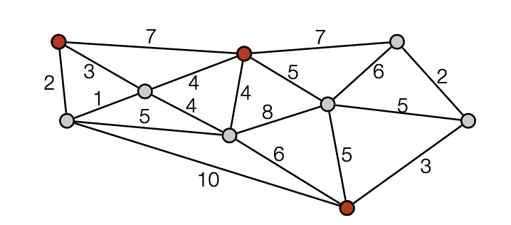

> Pick arbitrary $i$ into $C$.
>
> Find site $j$ farthest away from any cluster center in $C$, then put $j$ into $C$.
>
> Repeat until $|C| = k$.

# Week12:

## 12.1 Traveling Salesman Problem

Set of cities  $\{1,…,n\}$

$c_ij ≥ 0$: cost of traveling from $i$ to $j$ with triangle inequality.

Find a tour of minimum cost visiting every city exactly once. (Hamiltonian cycle)

### Christofides algorithm

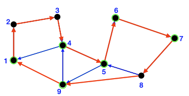

> Compute MST $T$, which is a lower bound on TSP.
>
> Consider set $O$ of all odd degree vertices in $T$.
>
> Find minimum cost perfect matching $M$ on $O$.
>
> $T + M$ is a Eulerian. It's connected and all nodes have even degree.
>
> Construct Euler tour $𝞃$ (visiting every edge exactly once). And shortcut into $𝞃'$ such that each vertex only visited once.
>
> > $len(𝞃') <= len(𝞃) = cost(T) + cost(M)$
> >
> > $cost(T) <= OPT$
> >
> > $cost(M) <= min(cost(O_1), cost(O_2)) <= \frac{OPT}{2}$
