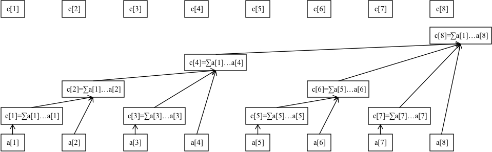
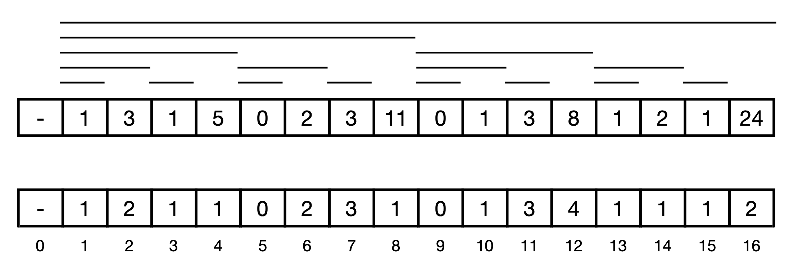

# Binary Indexed Tree

Binary Indexed Tree, aka Fenwick tree, supports **single-point modification** and **range query** and requires little code.



> Array $a$ represents the original data.
> 
> Array $c$ is used to store the information of a certain interval of $a$.
> 
>  $c[i] = \sum_{j=i-\operatorname{lowbit}(i)+1}^{i} a[j]$: the sum of $a[i-lowbit(i)+1, i]$

## Lowbit



> The length of the interval governed by $c[x]$ is specified to be $2^k$.
> 
> $k$ is the index number of bits where the first bit $1$ occurs in the most right.
>
> $2^k$ is the value represented by the lowest set bit of x. 

For example, $88_{(10)}=01011000_{(2)}$ , its lowest bit $1$ and the following $0$ form the binary $1000$ , which is $8$. Therefore, $c_{88}$ represents the interval information of $a[81 \ldots 88]$.

```cpp
// This trick takes advantage of two’s complement binary representation. 
// The bitwise AND of x and -x gets the value represented by the lowest set bit of x.
int lowbit(int x) {
    return x & (-x); // 2^k
}
```

## Build 
```cpp
void init() {
  for (int i = 1; i <= n; ++i) {
    t[i] += a[i];
    int j = i + lowbit(i);
    if (j <= n) t[j] += t[i];
  }
}
```

## Prefix Sum Query

