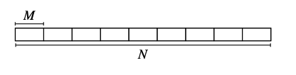
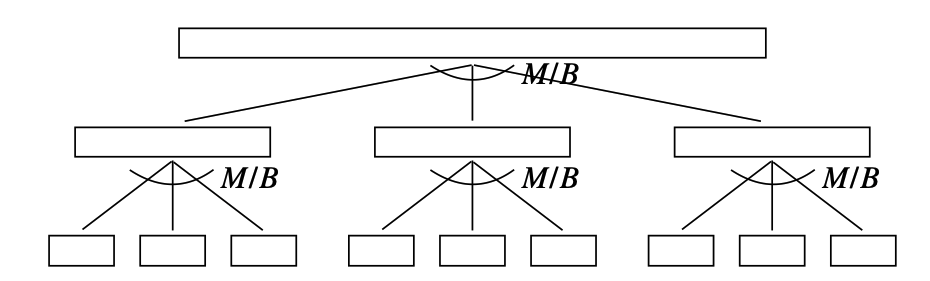
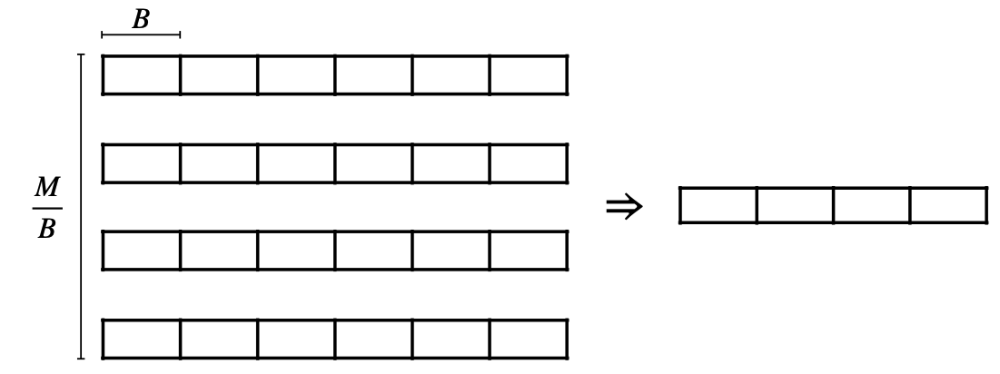

# External Merge Sort

N = number of elements

M = memory size

B = block size

1. Partion N elememts into $\frac{N}{M}$ arrays of size M. Load each array into memeory and sort, then write sorted array back into disk.

   
   > Each array is guaranteed in order. Loading each array cost $\frac{M}{B}$ I/Os, and there are $\frac{N}{M}$ arrays.
   >
   > Total I/Os: $O(\frac{N}{B})$ * 2

2. Apply **M/B way external multiway merge** until left with single sorted array.

    

    * M/B way external multiway merge

        
        > 1. Load M/B first blocks into memory. Each raw is corresponding to each array.
        > 2. Since each array is sorted, output the smallest number among blocks, then write the sorted block back into disk
        > 3. If one block is fetched all numbers, load its next block in the same array.
    
    > Each level always read N elements in total, so each level costs $O(\frac{N}{B})$ I/Os.
    >
    > Height of tree: $\log_{\frac{M}{B}} \frac{N}{M}$, because $\frac{N}{M}$ arrays be merged $\frac{M}{B}$ at a time.
    >
    > Total I/Os: $O\left(\frac{N}{B} \log_{\frac{M}{B}} \frac{N}{M} \right)$

